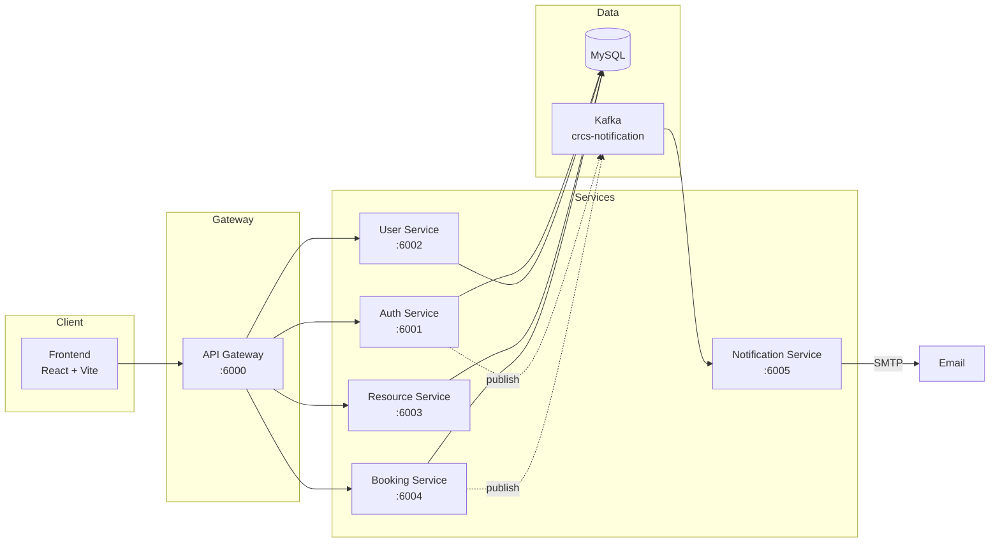
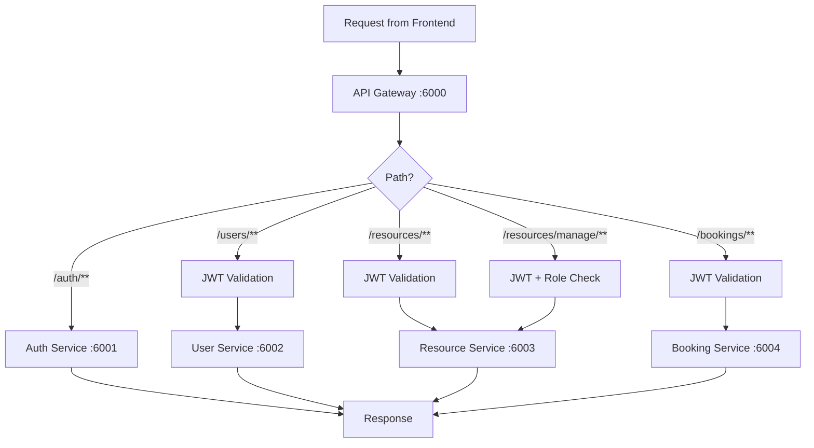
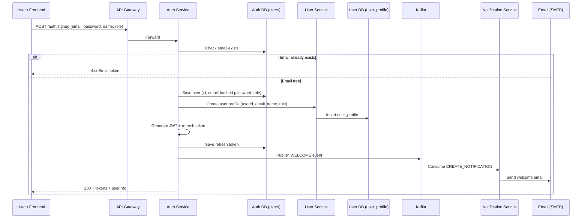
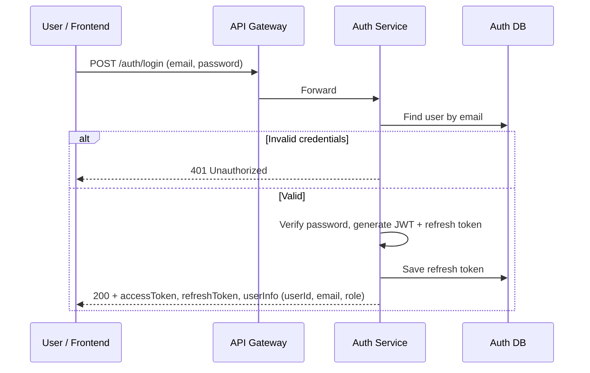
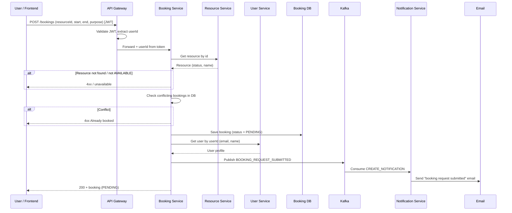
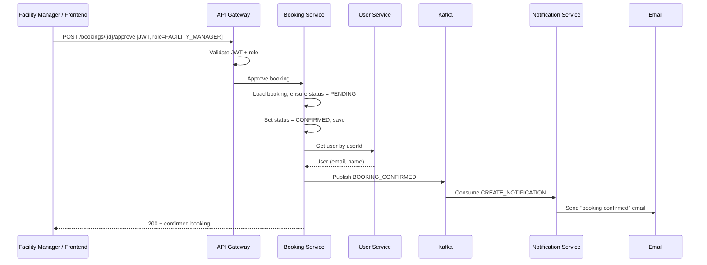
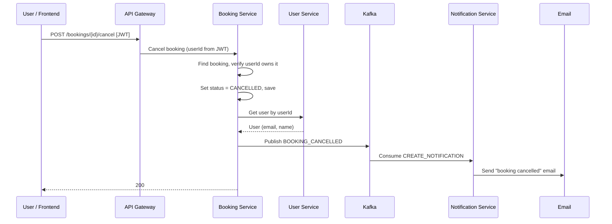
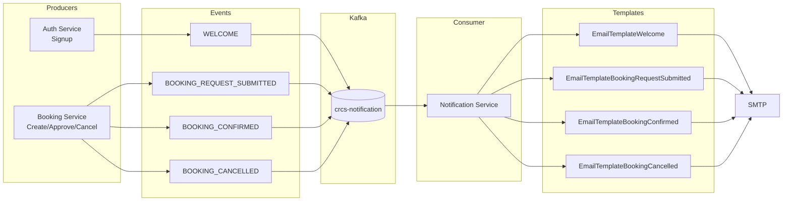
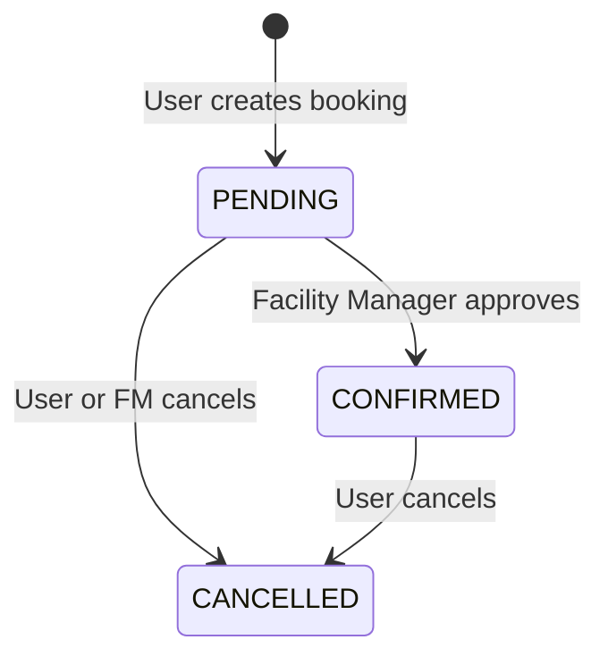
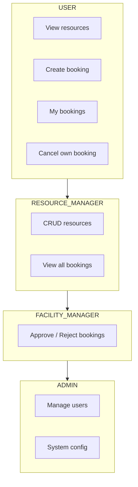

# CRCS — End-to-End Visual Workflow

This document describes the main flows of the Campus Resource Coordination System using diagrams and short explanations. All diagrams use [Mermaid](https://mermaid.js.org/) and render in GitHub, GitLab, and most Markdown viewers.

---

## 1. System Overview

- **Frontend** talks only to the **API Gateway** (single entry point).
- **Gateway** validates JWT (except for `/auth/**`) and routes to the correct service.
- **Auth** and **Booking** publish events to **Kafka**; **Notification Service** consumes them and sends emails.

---

## 2. API Gateway Request Flow

- **`/auth/**`** — No JWT; used for login, signup, refresh, validate.
- **`/users/**`, `/resources/**`, `/bookings/**`** — Require valid JWT.
- **`/resources/manage/**`** — Requires JWT + RESOURCE_MANAGER (or higher) role.

---

## 3. Signup (Registration) Flow

- User is stored in **Auth DB** and a profile is created in **User Service**.
- **Welcome email** is sent asynchronously via Kafka → Notification Service → SMTP.

---

## 4. Login Flow

- Frontend stores **access token** and **refresh token**; access token is sent in `Authorization` for protected APIs.

---

## 5. Create Booking Flow (End-to-End)

- Booking is created in **PENDING** state. Resource status is not changed until approval.
- User receives an email that their **booking request** was submitted.

---

## 6. Approve Booking Flow (Facility Manager)

- Only **FACILITY_MANAGER** (or ADMIN) can approve; this is enforced at the gateway/service layer.
- Booker receives a **booking confirmed** email.

---

## 7. Cancel Booking Flow

- Only the **booking owner** can cancel. Notification service sends a **booking cancelled** email.

---

## 8. Notification Pipeline (Kafka → Email)

- All notification events are **CREATE_NOTIFICATION** with a template type and payload.
- **Notification Service** consumes from `crcs-notification`, picks the right email template, and sends via SMTP.

---

## 9. Booking State Lifecycle

- **PENDING**: Just created; waiting for approval.
- **CONFIRMED**: Approved by Facility Manager.
- **CANCELLED**: From either PENDING or CONFIRMED; cancellation email is sent when applicable.

---

## 10. Role-Based Access (Summary)

- **USER**: View resources, create/manage own bookings.
- **RESOURCE_MANAGER**: Plus resource CRUD and view all bookings.
- **FACILITY_MANAGER**: Plus approve/reject pending bookings.
- **ADMIN**: Full access including user management.

---

## Summary

| Flow              | Entry point        | Key services              | Async (Kafka)     |
|-------------------|--------------------|---------------------------|--------------------|
| Signup            | POST /auth/signup  | Auth, User, Notification  | Welcome email      |
| Login             | POST /auth/login   | Auth                      | —                  |
| Create booking    | POST /bookings     | Booking, Resource, User   | Request submitted  |
| Approve booking   | POST /bookings/…/approve | Booking, User      | Booking confirmed  |
| Cancel booking    | POST /bookings/…/cancel  | Booking, User      | Booking cancelled  |

All user-facing traffic goes through the **API Gateway**; **Auth** and **Booking** drive the **notification** flow via **Kafka** to the **Notification Service**, which sends emails using the configured SMTP settings.
